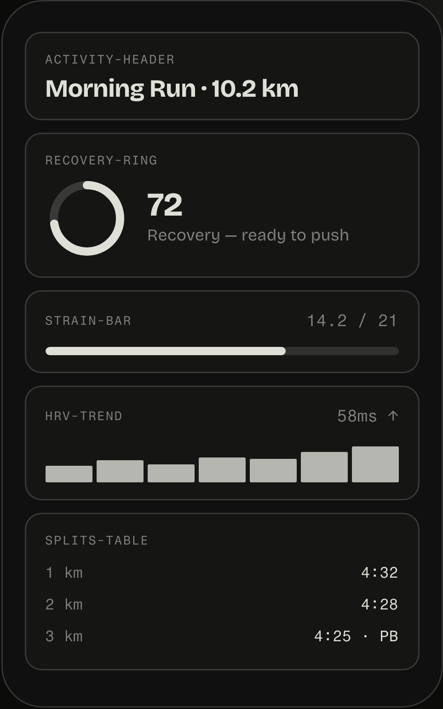
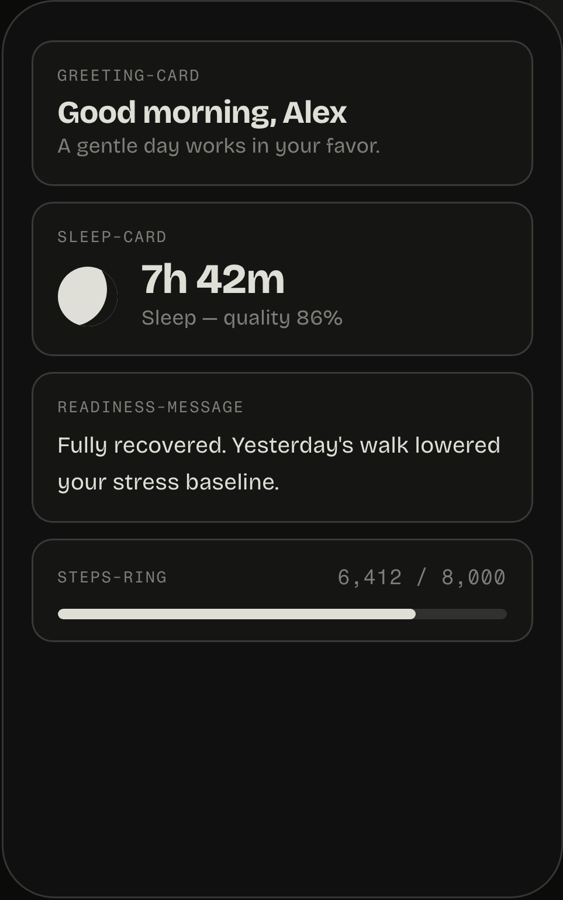
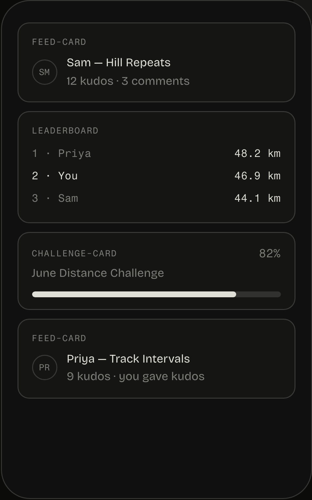
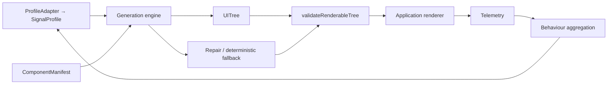
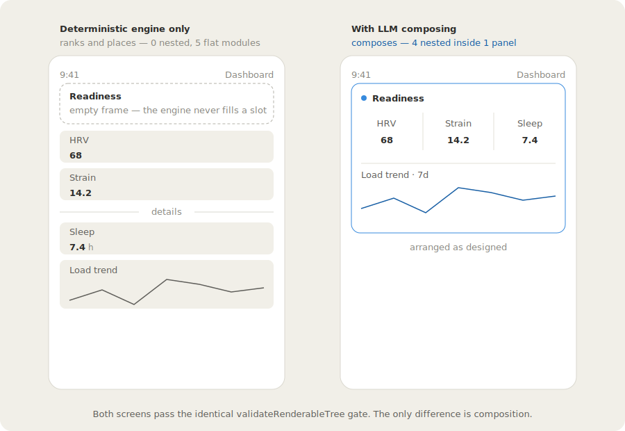

# DynUI

> **Status: experimental / alpha.** APIs will change.

**Contract-validated personalised UI for modern apps**

DynUI is a self-hosted framework for teams that want application surfaces to adapt to
user behaviour, segments, consent and experiments while keeping the rendered interface
inside a governed design system.

Instead of choosing between a small number of manually authored screens, teams register
real components with behavioural contracts. DynUI then composes a per-user server-driven
UI tree from that approved vocabulary and validates the result before it can render.

<p align="center">
  
  
  
</p>

<p align="center"><em>One activity, three screens — the same registered vocabulary composed for a performance-, recovery-, and social-oriented user.</em></p>

## Why DynUI

Most personalisation tools change content inside a fixed interface.

DynUI is designed for personalisation that changes the structure of the screen,
including:

- which modules appear;
- which components are promoted above the fold;
- how dense the screen becomes;
- how supporting components are grouped or nested;
- which component variants are selected;
- how experiments are attributed.

DynUI keeps this personalisation bounded by components and rules defined by your design
and engineering teams.

### Contracts, not prompts

Designers and engineers define the available component vocabulary, supported surfaces,
data requirements, audience rules, slots, accessibility requirements and experiment
gates.

Models cannot invent arbitrary components, markup or application code.

### Deterministic by default

DynUI includes a deterministic generation engine that can personalise screens without
calling a model.

Model providers are optional and are best used for background generation, cache warming
or session-boundary refinement.

### Validated before render

Generated output is represented as a registered `UITree`.

Every tree must pass strict validation before it can be rendered by the application.

### Designed for your existing stack

Bring your own:

- design system;
- renderer;
- profile store;
- experimentation platform;
- telemetry system;
- model provider.

### Consent-aware

Users without sufficient signals or personalisation consent receive a neutral baseline
rather than an inferred personalised experience.

### Measurable

Experiments and outcomes remain attached to registered components and variants instead
of being hidden inside unrestricted model output.

## Quickstart

Clone the repository and run the default demonstration:

```bash
git clone https://github.com/DynUI/DynUI-OSS-Framework.git
cd DynUI-OSS-Framework
npm install
npm run demo
```

For the complete setup, explanation and integration walkthrough, follow the:

[DynUI Quickstart →](https://www.dynui.dev/getting-started/quickstart/)

## Explore the examples

DynUI includes examples covering deterministic generation, behavioural adaptation,
experimentation and model-assisted composition.

```bash
npm run demo
```

Run the core DynUI example.

```bash
npm run demo:no-model
```

Generate a personalised screen using the deterministic engine with no model credentials.

```bash
npm run demo:behavior
```

See how accumulated user behaviour changes the generated screen.

```bash
npm run demo:experiment
```

Explore component-level experiment assignment and attribution.

```bash
npm run demo:persist
```

Run the persistence example.

```bash
npm run demo:figma
```

Explore the Figma-to-manifest workflow.

```bash
npm run demo:ceiling
```

Compare deterministic ranking with model-assisted nested composition.

```bash
npm run gen:verify
```

Verify generated output against the DynUI contracts.

```bash
npm run eval:contracts
npm run eval:generation
```

Run contract and generation evaluations.

## When to use DynUI

Use DynUI when personalisation needs to alter the structure or hierarchy of an
application surface.

Typical use cases include:

- consumer applications;
- health and fitness products;
- marketplaces;
- media and content platforms;
- fintech dashboards;
- developer tools;
- internal workflow products;
- products with mature design systems and meaningful behavioural signals.

DynUI is especially suitable when two valuable users should not necessarily see the same
arrangement of the same product capabilities.

## When not to use DynUI

Use a feature flag, CMS or standard experimentation tool directly when you only need to:

- toggle a single feature;
- swap text or imagery;
- publish editorial content;
- show a fixed variant;
- run a simple static A/B test.

Read the full comparison:

[DynUI comparisons and decision guide →](docs/COMPARISONS.md)

## For developers

DynUI provides a framework for safely composing personalised application screens from
registered components.

The framework includes:

- public TypeScript contracts and schemas;
- deterministic generation;
- optional model-provider interfaces;
- strict context-aware validation;
- deterministic fallbacks;
- privacy and consent enforcement;
- manifest linting;
- experimentation primitives;
- telemetry integration seams;
- test and evaluation harnesses;
- reference renderer examples.

DynUI does not host a control plane or replace your existing infrastructure.

Your application retains ownership of:

- the renderer registry;
- component implementation;
- user profile data;
- experiment assignment;
- telemetry;
- analytics;
- model endpoints.

[Read the developer documentation →](docs/QUICKSTART.md)

## For designers

DynUI does not replace Figma, your component library, variants, auto-layout or design
tokens.

Designers continue to create application components as normal, then add behavioural
information describing:

- where a component may appear;
- which audiences it is suitable for;
- its relative priority;
- which data it requires;
- which variants may be selected;
- which components may be nested inside it;
- which accessibility and brand rules must always hold.

For example:

````markdown
```dynui
{
  "id": "recovery-score-card",
  "category": "insight",
  "description": "Shows the user's recovery readiness.",
  "surfaces": ["activity-detail"],
  "audience": ["wellness"],
  "priority": 80
}
```
````

DynUI uses these contracts to compose different arrangements of components while
remaining inside the approved design system.

Designers retain ownership of the visual language. DynUI governs how approved components
may be selected and arranged.

[Read the designer workflow →](docs/FIGMA_EXPORT.md)

## Architecture

DynUI separates profile data, eligibility, generation, validation, rendering and
telemetry.



The generated output can only reference registered components.

The validator is the final gate before rendering. If generation produces an invalid
result, DynUI repairs it, falls back to deterministic generation or returns an explicitly
non-renderable result.

Request-time rendering should use deterministic generation or previously cached trees.
Live model calls should generally run outside the critical render path.

[Explore the full architecture →](https://www.dynui.dev/docs/ADD_ARCHITECTURE_ROUTE/)

## Deterministic and model-assisted generation

DynUI treats deterministic generation as the reliable floor.

The deterministic engine:

- requires no model credentials;
- is fast and request-safe;
- produces byte-stable output;
- ranks eligible components;
- selects variants;
- creates a valid layout;
- returns structured explanations.

For many surfaces, deterministic ranking is sufficient.

A model becomes useful when the interface requires more complex composition, such as:

- nested component groups;
- contextual hierarchy;
- interaction between multiple user signals;
- composition across a large component vocabulary.

Models operate inside the same constraints as deterministic generation.

They receive an eligible vocabulary and their output must pass the same validation gate.
A model may arrange registered components, but it cannot introduce unregistered
components or arbitrary application code.



The `readiness-panel` is the tell. On the left it is a hollow frame with its metrics
scattered as flat siblings, and the above-the-fold cap pushes sleep and the load trend
below a "details" divider, fragmenting a group meant to read as one card. On the right, a
model nests the same four components inside the panel. Same manifest, same data, same
validator — the only difference is composition. Run `npm run demo:ceiling` to see both
trees side by side, with no API key required.

[Read about bounded generation →](packages/generate/README.md)

## Safety and governance

DynUI is designed around bounded generation.

The component manifest defines the only vocabulary that may appear in generated output.

The safety model includes:

- component eligibility checks;
- surface restrictions;
- data requirement validation;
- consent enforcement;
- required and pinned components;
- slot and nesting constraints;
- accessibility rules;
- experiment gates;
- strict tree validation;
- deterministic fallback behaviour;
- explicit non-renderable failure states.

This means an invalid generated layout cannot be mistaken for a valid renderable screen.

[Read the safety model →](packages/validate/README.md)

## Project scope

DynUI is a self-hosted, bring-your-own-provider framework.

**DynUI provides**

- component contracts and schemas;
- component manifests;
- deterministic generation;
- optional model generation interfaces;
- validation;
- fallback behaviour;
- consent and privacy rules;
- experimentation primitives;
- telemetry interfaces;
- reference implementations;
- tests and evaluations.

**DynUI does not provide**

- a hosted control plane;
- a managed component registry;
- a bundled model;
- a hosted experimentation service;
- a hosted profile store;
- an analytics warehouse;
- user or team account management;
- a replacement for your design system.

These are integration boundaries rather than missing framework features.

## Documentation

The canonical DynUI documentation is published at:

https://www.dynui.dev

### Start here

- [Quickstart](https://www.dynui.dev/getting-started/quickstart/) — install DynUI and generate your first personalised interface.
- [Tutorial](docs/ADOPTION_NEWS.md) — build a personalised screen from component contracts through to rendering.
- [Core concepts](https://www.dynui.dev/docs/ADD_CONCEPTS_ROUTE/) — understand manifests, profiles, generation, validation and UI trees.
- [Developer guides](docs/QUICKSTART.md) — integrate DynUI into an application and connect your existing services.
- [Designer workflow](docs/FIGMA_EXPORT.md) — define behavioural contracts for design-system components.
- [Architecture](https://www.dynui.dev/docs/ADD_ARCHITECTURE_ROUTE/) — understand the runtime, providers and integration boundaries.
- [API reference](packages/) — explore package interfaces, schemas and configuration.

Documentation stored within this repository is primarily intended for contributors,
implementation details and source-level reference.

Where repository documentation conflicts with the published website, please open a
documentation issue.

## Repository structure

```text
.
├── packages/          # Core DynUI packages
├── apps/              # Reference renderer applications
├── examples/          # Runnable demonstrations and integration examples
├── docs/              # Implementation and contributor documentation
├── eval/              # Contract and generation evaluations
├── scripts/           # Build, validation and demonstration tooling
├── tests/             # Automated tests
└── README.md
```

## Development

Install dependencies:

```bash
npm install
```

Run the test suite:

```bash
npm test
```

Run type checking:

```bash
npm run typecheck
```

Build the project:

```bash
npm run build
```

Run the smoke tests:

```bash
npm run smoke
```

Run visual tests:

```bash
npm run test:visual
```

Lint a component manifest:

```bash
npm run lint:manifest
```

Generate JSON schemas:

```bash
npm run gen:schema
```

## Contributing

DynUI welcomes contributions from developers, designers, researchers and technical
writers.

Useful contribution areas include:

- framework features;
- renderer integrations;
- adapters;
- tests and evaluations;
- accessibility;
- component-contract examples;
- Figma workflows;
- documentation;
- tutorials;
- design-system examples;
- bug reports;
- implementation feedback.

Before contributing, read:

- [Contributing guide](CONTRIBUTING.md)
- [Code of conduct](CODE_OF_CONDUCT.md)
- [Security policy](SECURITY.md)

Browse:

- [Good first issues](https://github.com/DynUI/DynUI-OSS-Framework/issues?q=is%3Aissue+is%3Aopen+label%3A%22good+first+issue%22)
- [Help wanted issues](https://github.com/DynUI/DynUI-OSS-Framework/issues?q=is%3Aissue+is%3Aopen+label%3A%22help+wanted%22)
- [Open discussions](https://github.com/DynUI/DynUI-OSS-Framework/discussions)

When proposing a significant change, start with a GitHub Discussion or issue so the
approach can be agreed before implementation.

## Roadmap

DynUI is currently experimental and APIs may change.

Current priorities include:

- stabilising the core contracts;
- expanding renderer examples;
- improving the Figma workflow;
- strengthening evaluation tooling;
- adding integration examples;
- improving contributor documentation;
- gathering feedback from real application teams.

See the full roadmap:

[DynUI roadmap →](https://www.dynui.dev/docs/ADD_ROADMAP_ROUTE/)

## Community

- [GitHub Discussions](https://github.com/DynUI/DynUI-OSS-Framework/discussions)
- [GitHub Issues](https://github.com/DynUI/DynUI-OSS-Framework/issues)
- [DynUI website](https://www.dynui.dev/)
- [Documentation](https://www.dynui.dev/docs/)

Use Discussions for questions, ideas, architecture proposals and examples of what you are
building.

Use Issues for reproducible bugs and clearly scoped implementation work.

## Security

Do not report security vulnerabilities through public GitHub issues.

Follow the instructions in:

[SECURITY.md](SECURITY.md)

## Licence

DynUI is available under the [Apache-2.0 licence](LICENSE).
