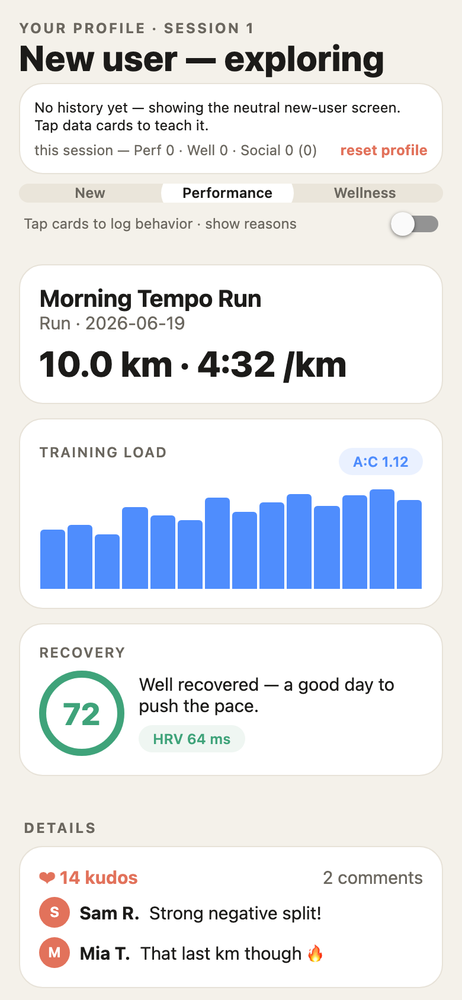
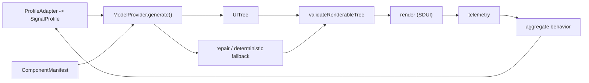

# DynUI

> **Status: experimental / alpha.** APIs will change. Not yet published to a registry.

**Contract-validated personalized UI for modern apps.**

DynUI is a self-hosted framework for teams that want app surfaces to adapt to
user behavior, segments, consent, and experiments while keeping the actual UI inside
a governed design system. Instead of choosing between a few manually authored
variants, you register real components with behavioral contracts. A deterministic
engine, or an optional model provider, composes a per-user server-driven UI tree from
that vocabulary; the validator rejects anything off-contract before it can render.

Use it when personalization needs to change **screen structure**: which modules
appear, how dense the view is, what gets promoted above the fold, which supporting
components are nested into a panel, and how experiments are attributed. Reach for a
feature flag, CMS, or A/B testing tool instead when you only need to swap copy,
toggle one component, or target a static variant.

DynUI is built for product engineering teams who already have a design system,
real user signals, and a need to safely personalize complex application surfaces:
consumer apps, marketplaces, media products, health and fitness apps, fintech
dashboards, developer tools, internal workflow software, and any product where two
valuable users should not necessarily see the same screen.



Why teams adopt this shape:

- **Contracts, not prompts, define the UI.** Designers and engineers declare the
  component vocabulary, allowed surfaces, data requirements, audience rules, slots,
  accessibility requirements, and experiment gates.
- **The render path is bounded.** Generated output is a `UITree` of registered
  components, not markup or arbitrary code, and every tree is validated before render.
- **Models are optional.** The deterministic engine can compose valid personalized
  screens without any model call; live providers are best used for background
  generation, cache warming, or session-boundary refinement.
- **It fits your stack.** Bring your own profile adapter, model provider,
  experimentation system, telemetry sink, and renderer.
- **Personalization stays measurable.** Experiments attach to registered
  components/variants, so outcomes are attributable instead of being hidden inside
  raw model output.

The reference app is a fitness tracker: the same activity renders differently for a
performance, wellness, or social user, and adapts as the user's behavior accumulates.

## Project Scope

DynUI is a **self-hosted, bring-your-own-provider framework**. It integrates
with the model, experimentation, profile, and telemetry systems you already run — it
does not host anything for you or replace those systems.

**What this project provides:**

- public contracts and schemas;
- deterministic generation and a deterministic fallback;
- strict, context-aware validation;
- privacy and consent enforcement;
- manifest linting and governance primitives;
- reference renderer examples;
- test and eval harnesses;
- documented integration seams for model providers, profile stores, experiment
  assignment, telemetry, and renderers.

**What this project does not provide (by design):** a hosted control plane, a
managed or bundled model, a hosted registry console, a managed experimentation
service, an analytics warehouse, or team account management. These are
**integration boundaries**, not missing features — you connect your own model
endpoint, experiment engine, profile store, and telemetry sink behind the documented
adapter interfaces; your app also owns the renderer registry that maps manifest
components to native UI. Live model generation is optional; the deterministic engine
runs with no model credentials at all. See [When not to use this](#when-not-to-use-this)
for cases where a feature flag or CMS is the better tool.

## When to use this

Use DynUI when personalization changes the **structure** of an application screen:
which modules appear, how dense the view is, which components are nested together,
which modules are promoted above the fold, and how component-level experiments are
attributed.

If you only need to toggle a feature, swap copy, publish editorial content, or show
a static A/B variant, use a feature flag, CMS, or testing platform directly. See
[Comparisons](docs/COMPARISONS.md).

## Architecture



## Safety Model

Bounded generation makes this safe: the manifest is the only vocabulary, the validator
is the gate, and a deterministic heuristic engine is the fallback — a device never
blocks on or breaks because of the model. The fallback contract is precise:
`generateScreen` returns **either** a valid renderable tree **or** an explicit
non-renderable result (`unrenderable: true`, `validation.ok: false`) that the app
cannot mistake for a safe screen — it never returns a renderable-looking tree that is
actually invalid. The deterministic engine itself is production-grade: staged
(eligibility → scoring → layout → variant → explanation), byte-stable, configurable
via a `RankPolicy`, with PII-free cache keys and a structured explanation per
component. See [packages/generate/README.md](packages/generate/README.md).

Request-time render paths should use deterministic generation or cached trees.
Live model calls are optional and should run in background, cache-warming, or
session-boundary flows behind a timeout budget.

## Packages

| Package | Responsibility |
|---------|----------------|
| `@dynui/contracts` | The shared types: `SignalProfile`, `ComponentManifest`, `UITree`, `ModelProvider`, `ProfileAdapter` |
| `@dynui/signal` | Resolve and evaluate signal-path conditions against a profile |
| `@dynui/validate` | Validate a generated `UITree` against the manifest + constraints |
| `@dynui/generate` | Compose screens: heuristic engine, LLM providers (Anthropic / OpenAI-compatible), repair + fallback |
| `@dynui/experiments` | Component-level assignment, logging, and promote/rollback analysis |
| `@dynui/telemetry` | Turn interaction events into behavior signals + an inferred archetype |
| `@dynui/profile` | Profile Adapter implementations (in-memory, file-backed); persist behavior across sessions |
| `@dynui/privacy` | Anonymization (salted HMAC), sensitivity model, prompt minimization, log/error redaction, consent gates |

`apps/fitness-app` is the reference React Native / Expo renderer. It renders the
actual `UITree` model — slot children nest inside their parent component (true
composition, not a flat list) — guarded by a renderer registry contract
(`checkRendererCompat`) and per-component error boundaries. See
[apps/fitness-app/README.md](apps/fitness-app/README.md).

## Quickstart

```bash
npm install

npm run demo            # generate the three archetype screens (no API key needed)
npm run demo:no-model   # a non-fitness (news) domain, fully deterministic, no model
npm run demo:experiment # canary a component, get a promote/rollback decision
npm run demo:behavior   # cold user → session of taps → screen morphs
npm run demo:persist    # behavior persists across a simulated relaunch
npm test                # run the test suite (includes the contract + generation evals)
npm run typecheck

npm run eval:contracts   # validate the fixture corpus: every validator rule, pass + fail
npm run eval:generation  # prove generation yields a valid tree or an explicit non-renderable
                         # result (heuristic / invalid / malformed; live model only with DYNUI_EVAL_LIVE=1)
npm run test:visual      # browser proof that valid fixtures render a coherent screen and
                         # an unknown component falls back safely (Playwright + Chromium)
```

`npm run test:visual` drives a headless Chromium over a renderer harness for six
fixtures (flat, nested-slot, no-consent, experiment-gated, missing-optional-data, and
a negative unknown-component case) across mobile and desktop viewports, asserting the
page is non-blank, expected components appear, and invalid composition is surfaced by
the safe fallback. It needs a browser (`npx playwright install chromium`) and skips
cleanly when none is present; CI installs one. It is **required before release**.

The eval harness (`eval/`) measures behavior against a fixture corpus under
`tests/fixtures/` with thresholds encoded in code, so CI fails on any regression.
See [tests/fixtures/README.md](tests/fixtures/README.md).

Run generation against a real model:

```bash
echo "OPENROUTER_API_KEY=sk-or-..." > .env   # or ANTHROPIC_API_KEY
echo "DYNUI_MODEL=anthropic/claude-sonnet-4.5" >> .env
npm run gen:verify       # measures first-try validity, repair %, fallback %, latency, tokens
```

The reference app:

```bash
cd apps/fitness-app
npm install
npx expo start --web     # or i / a for native
```

## Concepts

- **Behavioral contract** — each component declares `audience`, `surfaces`, `showWhen` /
  `hideWhen` signal conditions, `priority`, and an optional `experiment` gate.
- **Bounded generation** — the model emits a `UITree` of references to manifest
  components; `@dynui/validate` is the **safety boundary** that rejects anything
  off-contract: surface/audience/consent eligibility, hard `showWhen`/`hideWhen`,
  data existence + types, declared props only (no arbitrary/unsafe props), layout
  rails, and accessibility — each with a stable error code and node path. See
  [packages/validate/README.md](packages/validate/README.md).
- **Runtime schemas** — every public artifact (`SignalProfile`, `ComponentManifest`,
  `UITree`, `GenerationRequest`, telemetry events, experiment defs) has a hand-rolled,
  zero-dependency runtime schema in `@dynui/contracts` (`parseComponentManifest`,
  `migrateManifest`, …) that rejects malformed shapes and unsupported versions before
  any logic runs. JSON Schema artifacts are emitted from the same definitions
  (`npm run gen:schema`, shipped under `@dynui/contracts/schema`).
- **Consent & privacy** — consent is enforced in code everywhere: no
  personalization → neutral screen (validator rejects archetype-restricted
  components); no analytics → no telemetry capture or behavior ingestion. The model
  receives a minimized projection (no identifiers, no raw behavior, no sensitive
  fields), ids are salted-HMAC anonymized, and logs/errors are redacted. See
  [docs/PRIVACY.md](docs/PRIVACY.md).
- **Experiments** — the unit under test is a registered component/variant, so outcomes
  attribute cleanly; gated components never appear without the enabling assignment.

## When not to use this

DynUI earns its complexity only when personalization changes **screen
structure**. If your need is simpler, a lighter tool is the right call:

- **You only need to toggle a feature or swap one component.** Use a **feature flag**
  (LaunchDarkly, GrowthBook, Statsig, Unleash). You don't need a component manifest,
  a generation engine, or a validator to flip a boolean.
- **You're A/B testing copy, an image, or a single static variant.** Use your **A/B
  testing / experimentation tool** directly. (DynUI *integrates* with these for
  component-level assignment — but if the variant is static, you don't need it.)
- **You're publishing editorial content or marketing pages.** Use a **CMS**
  (Contentful, Sanity, etc.). Content modeling and scheduling are what those do well.
- **You want the model to design freely.** This isn't that. Generation is **bounded**:
  the model only arranges components that already exist in your manifest. If you want
  open-ended layout/markup generation, this framework will feel like a straitjacket
  (by design).
- **You don't have real user signals or a design system yet.** The value comes from
  composing a governed component vocabulary against a `SignalProfile`. Without either,
  start simpler and adopt this when structural personalization becomes a real need.

Reach for DynUI when *which modules appear, how dense the view is, what's
promoted above the fold, and how experiments attribute* must vary per user — safely,
within a known vocabulary.

## Docs

- [Quickstart & adoption guide](docs/QUICKSTART.md) — zero to a personalized screen.
- [Adoption walkthrough: a non-fitness domain](docs/ADOPTION_NEWS.md) — a news feed, no model.
- [Privacy & data handling](docs/PRIVACY.md) — what data is used, consent, deletion.
- [Versioning & upgrade policy](docs/UPGRADE.md) — semver, schema migration, compat matrix.
- [Production deployment checklist](docs/DEPLOYMENT.md) — release and runtime gates.
- [Model providers](docs/MODEL_PROVIDERS.md) — optional live providers and custom adapters.
- [Deterministic-only mode](docs/DETERMINISTIC_ONLY.md) — no model, no provider SDK.
- [Figma export workflow](docs/FIGMA_EXPORT.md) — turn design annotations into manifests.
- [Experiment adapters](docs/EXPERIMENT_ADAPTERS.md) — bridge external assignment systems.
- [Renderer implementation guide](docs/RENDERER_IMPLEMENTATION.md) — registry, slots, fallbacks.
- [Comparisons](docs/COMPARISONS.md) — feature flags, CMS, A/B testing, SDUI.
- [Releasing](docs/RELEASING.md) — reproducible CI release, provenance, supported Node.
- [Governance](GOVERNANCE.md) · [Contributing](CONTRIBUTING.md) ·
  [Security policy](SECURITY.md) · [Changelog](CHANGELOG.md).
- Per-package API references live in each `packages/*/README.md`.

Examples: `examples/fitness/` (reference domain + the `apps/fitness-app` renderer),
`examples/news/` (minimal non-fitness domain), `npm run demo:no-model` (a fully
deterministic, no-model run), and
[`examples/integrations/`](examples/integrations/README.md) (lightweight adapters for
an external experiment engine, an HTTP profile store, and a telemetry warehouse —
examples, not dependencies).

## License

[Apache-2.0](LICENSE).
