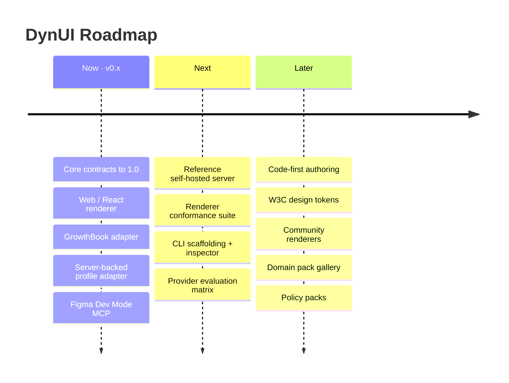

# DynUI Roadmap

  <a href="README.md"><strong>Overview</strong></a> ·
  <a href="https://www.dynui.dev/getting-started/quickstart/"><strong>Quickstart</strong></a> ·
  <a href="https://github.com/DynUI/DynUI-OSS-Framework/discussions"><strong>Discussions</strong></a> ·
  <a href="CONTRIBUTING.md"><strong>Contributing</strong></a>

> [!NOTE]
> DynUI is **experimental / alpha** and APIs may change. This roadmap describes
> direction and priorities, not commitments or dates. It evolves through
> [Discussions](https://github.com/DynUI/DynUI-OSS-Framework/discussions) and community
> feedback — proposals are welcome.

DynUI is the open framework for **contract-validated, bounded generative UI**. The
roadmap grows the project along two axes:

- **Widen the ecosystem** that plugs into DynUI's integration seams — renderers, model
  providers, profile stores, experimentation platforms and telemetry sinks.
- **Deepen the safety boundary** that every generated screen must pass — the validator,
  privacy and consent rules, and the evaluation harnesses.

---

## How to read this roadmap

Work is grouped into three rolling horizons rather than fixed dates.

| Marker | Horizon | Meaning |
| :----: | :------ | :------ |
| 🟢 | **Now** | Active or next-up for the current `v0.x` line. |
| 🔵 | **Next** | Planned once the current horizon lands. |
| ⚪ | **Later** | Directional; shape and priority still being explored. |

---

## Horizons at a glance

| Horizon | Focus | Headline deliverables |
| :------ | :---- | :-------------------- |
| 🟢 **Now** | Stabilise the core and reach the largest audience | Contract `1.0` RFC process · web/React renderer · GrowthBook experiment adapter · server-backed profile adapter · Figma Dev Mode MCP |
| 🔵 **Next** | Make DynUI easy to run and extend | Reference self-hosted server · renderer conformance suite · CLI `init` + local inspector · per-model evaluation matrix |
| ⚪ **Later** | Grow the ecosystem and lower the authoring barrier | Code-first authoring · W3C design tokens · community renderers · domain-pack gallery · safety policy packs |

---

## 🟢 Now — stabilise the core, reach the largest audience

### Core contracts towards `1.0`
The most valuable milestone for everyone building on DynUI. Freeze the public
contracts — `UITree`, `ComponentManifest`, `SignalProfile`, `SignalModel`,
`BehaviourEvent` and `ExperimentDef` — as a versioned specification with:

- a published compatibility matrix and semantic-versioning policy;
- migration tooling (`migrateManifest` / `migrateUITree`) for every schema bump;
- a lightweight **RFC process** for proposing contract changes.

A stable contract is what lets third parties build renderers and adapters with
confidence.

### Web / React renderer
Today's reference renderer targets Expo / React Native. A first-class **web/React
renderer** opens DynUI to a much larger audience and is already proven viable by the
visual-test harness that exercises the DOM path.

### GrowthBook experiment adapter
The first external `AssignmentAdapter`, connecting DynUI's component-level
experimentation primitives to a widely used open experimentation platform.

### Server-backed profile adapter
An HTTP `ProfileAdapter` reference so applications that cannot resolve profiles
client-side can call `resolveProfile` / `ingestBehaviour` over the network — with PII
remaining in your infrastructure.

### Figma Dev Mode MCP
Extend the authoring workflow beyond the Figma REST path to the **Dev Mode MCP** for
richer, more accurate extraction of behavioural contracts from design components.

---

## 🔵 Next — easy to run, easy to extend

### Reference self-hosted server
A thin, **single-tenant** HTTP service exposing `resolveProfile`, `generateScreen` and
`ingestBehaviour`, with the deterministic cache (`buildCacheKey`) in front. Shipped as a
deployable example — one Node process, a file or SQLite store, Docker Compose — for
teams whose apps cannot call a model directly. Run-it-yourself by design.

### Renderer conformance suite
A published fixture pack plus `checkRendererCompat` so community renderers — SwiftUI,
Jetpack Compose, Flutter and others — can **self-certify** against the contracts.
DynUI ships the conformance tests; the community ships the renderers.

### CLI scaffolding and local inspector
Grow the `dynui` CLI into a first-class developer experience:

- `dynui init` to scaffold a new domain pack in a single command;
- expose the existing manifest `diff` tooling;
- a local **inspector** that visualises `NodeExplanation` — why each component was
  selected, ranked or suppressed. A single-developer debugging lens, run locally.

### Provider evaluation matrix
Publish per-model results from the existing `eval:generation` harness — first-try
validity, p95 latency and fallback rate — as a living comparison across model
providers. Useful guidance for adopters and honest, reproducible OSS data.

---

## ⚪ Later — grow the ecosystem, lower the authoring barrier

### Model-provider breadth
Additional bring-your-own-key adapters (OpenAI, Gemini) alongside the existing
Anthropic and OpenAI-compatible providers, plus **local model support** (Ollama /
llama.cpp via the OpenAI-compatible provider) — a natural fit for self-hosted
deployments. Models stay optional; DynUI remains deterministic by default.

### Code-first authoring
Derive manifests from **Storybook** or annotated component source, for teams whose
workflow is not centred on Figma.

### W3C design tokens
Connect the existing `requiredTokens` field to the emerging W3C Design Tokens standard,
and validate manifests against a shared token source.

### Additional renderers via the community
With the conformance suite in place, grow a catalogue of community-maintained renderers
across native and web stacks.

### Profile and data integrations
Reference `ProfileAdapter` implementations for common stores — Postgres, Redis and a
CDP-shaped example that maps customer-data-platform traits to a `SignalProfile`.

### Experimentation and telemetry breadth
Further `AssignmentAdapter` implementations (for example Statsig, LaunchDarkly) and
documented warehouse-export formats for the `EventSink` seam.

### Safety policy packs
Reusable validator configurations — for example a strict-privacy profile, a
children's-application profile — plus richer constraint and accessibility rules
(contrast, target size, layout-level constraints). Each rule ships with fixtures and
mutation tests, following the established pattern.

### Domain-pack gallery
More reference domains beyond fitness and news (e-commerce, media, SaaS dashboards) and
a "build a domain pack" guide. Domain packs are the ideal first contribution: no core
code, high demonstrative value.

---

## Themes at a glance

| Theme | Now | Next | Later |
| :---- | :--: | :--: | :--: |
| Core contracts & spec | 🟢 | | |
| Renderers | 🟢 | 🔵 | ⚪ |
| Authoring connectors | 🟢 | | ⚪ |
| Model providers | | 🔵 | ⚪ |
| Reference self-hosted server | | 🔵 | |
| Profile & data integrations | 🟢 | | ⚪ |
| Experimentation & telemetry | 🟢 | | ⚪ |
| Validator & safety | | | ⚪ |
| Developer experience | | 🔵 | |
| Domain packs | | | ⚪ |

---

## Out of scope

DynUI is a **self-hosted, bring-your-own-provider framework**. The following are
deliberately outside the project — they are integration boundaries, not missing
features:

- a hosted control plane or management console;
- a managed, multi-tenant component registry;
- a bundled or managed model;
- a hosted experimentation, profile or analytics service;
- user, team or account management.

Your application always retains ownership of its renderer registry, component
implementations, user data, experiment assignment, telemetry and model endpoints. See
[Project scope](README.md#project-scope) for the full boundary.

---

## Influence the roadmap

DynUI's direction is shaped in the open.

- 💬 Propose ideas and larger changes in [Discussions](https://github.com/DynUI/DynUI-OSS-Framework/discussions).
- 🐛 File scoped work and bugs in [Issues](https://github.com/DynUI/DynUI-OSS-Framework/issues).
- 🌱 Browse [good first issues](https://github.com/DynUI/DynUI-OSS-Framework/issues?q=is%3Aissue+is%3Aopen+label%3A%22good+first+issue%22) to get started.
- 📦 Renderers, adapters and domain packs are the highest-leverage contributions — see the [Contributing guide](CONTRIBUTING.md).

For significant changes, please open a Discussion or issue first so the approach can be
agreed before implementation.
